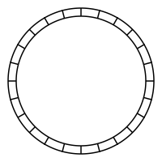

# Logd
## Logs for your apps in constant time and constant space with ultra-low latency.
A non-blocking circular buffer to store millions of logs per hour.


# Logd is a circular buffer
Logd (pronounced "logged") will never run out of storage. Reads & writes are constant time.

As the buffer becomes full, each write overwrites the oldest element.

# Auth
Logd authenticates clients for either reading or writing using 2 shared secrets.
These are stored encrypted in our secrets SOPS file.

# HTTP API
Logd starts a http server.
### GET /
```bash
curl --location "$LOGD_HOST/?limit=10" \
--header "Authorization: $LOGD_READ_SECRET"
```

# UDP
Logs are written by connecting to a UDP socket on port `:6102`.
```go
// error checks skipped for brevity
conn, _ := logdutil.GetConn(nil) // will use LOGD_HOST by default
data, _ := cbor.Marshal(&logdentry.Entry{
  Timestamp:  timestamp.UnixMilli(),
  Env:        env,
  Svc:        msg.Svc,
  Fn:         msg.Fn,
  Lvl:        strings.ToUpper(msg.Lvl),
  Msg:        msg.Msg,
  StackTrace: msg.StackTrace,
})
authedMsg, _ := logdutil.AuthMsg(logdWriteSecret, data)
conn.Write(authedMsg)
```