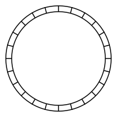

# Logd


## Logs for your apps in constant time and constant space.
Logd (pronounced "logged") is a circular buffer for writing & reading millions of logs per minute.

Logd will never run out of memory if the buffer size is ok for the given machine spec. Reads & writes are constant-time.

As the buffer becomes full, each write overwrites the oldest element.

# To Do
## Use circular buffer per alarm to store events
Currently, the app will OOM if we get a million errors. To solve this, use a circular buffer, as already used for main storage.
`Estimated time: 2 hours`

## Cleaner way of sending daily or hourly reports
Currently, the Period & Threshold are used to configure an alarm that fires daily. This is not a nice pattern. The intent of the alarm service does not align with the intent of that alarm configuration.
A better solution would be to trigger a report on a daily basis, using an alarm that collects the events but has no action.
`Estimated time: 2 hours`

## Fix Replay Vulnerability
There is currently no cache of UDP packet hashes, so we can't yet detect/prevent a replay. A ring buffer would probably be ideal for this.
`Estimated time: 2 hours`

# Auth
Logd authenticates clients for either reading or writing using 2 shared secrets.
These are stored encrypted in our secrets SOPS file.

## Why no SSO?
Writing is over UDP only, anyway. This will not change. This is an important design choice that ensures performance, but also separation of concerns.

If you want to put the HTTP API behind SSO, just write a proxy. ;)

This is a simple, performant & usable application that you can, and should, build on.

# HTTP API
Logd starts a http server.
## GET /
```bash
curl --location "$LOGD_HOST/?limit=10" \
--header "Authorization: $LOGD_READ_SECRET"
```
## GET /info

# UDP
## I'd tell you a joke about UDP, but you might not get it...
Logd is built on Protobuf & UDP.

## Logger
The simplest way to write logs is using the `log` package.
```go
l, _ := log.NewLogger(&log.LoggerConfig{
  Host:        "logd.fly.dev",
  WriteSecret: "the-secret",
  Env:         "prod",
  Svc:         "example-service",
  Fn:          "Readme",
})
l.Log(log.Info, "this is an example %s", "log message")
```

## Custom integration
Logs are written by connecting to a UDP socket on port `:6102`.
See the following example. Error checks skipped for brevity.
```go
// dial udp
addr, _ := conn.GetAddr("logd.fly.dev")
socket, _ := conn.Dial(addr)

// serialise message using protobuf
payload, err := proto.Marshal(&cmd.Cmd{
		Name: cmd.Name_WRITE,
		Msg: &cmd.Msg{
			T:          timestamppb.Now(),
			Env:        env,
			Svc:        cwmsg.Svc,
			Fn:         cwmsg.Fn,
			Lvl:        &lvl,
			Txt:        &cwmsg.Msg,
			StackTrace: st,
		},
	})

// get ephemeral signature using current time
signedMsg, _ := auth.Sign("some-secret-value", payload, time.Now())

// write to socket
socket.Write(signedMsg)
```

# Protobuf
Generate protobuf code
```bash
protoc --go_out=. cmd.proto # generate source files
```

